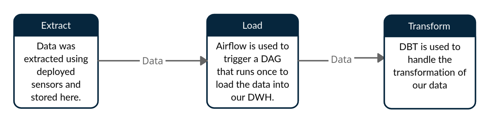

<p align="center">
  <a href="" rel="noopener">
 </a>
</p>

<h3 align="center">DWH</h3>

<div align="center">

[]()
[](https://github.com/kylelobo/The-Documentation-Compendium/issues)
[](https://github.com/kylelobo/The-Documentation-Compendium/pulls)
[](/LICENSE)

</div>

---

<p align="center"> Data Warehouse and ETL project for traffic PEMS dataset.
    <br> 
</p>

## 📝 Table of Contents

- [About](#about)
- [Getting Started](#getting_started)
- [Usage](#usage)
- [Built Using](#built_using)
- [TODO](./TODO.md)
- [Authors](#authors)
- [Acknowledgments](#acknowledgement)

## 🧐 About <a name = "about"></a>

Reusable modular ELT project consisting of building a data warehouse using MySQL, doing transformations using DBT and reporting using redash.


## 🏁 Getting Started <a name = "getting_started"></a>

These instructions will get you a copy of the project up and running on your local machine for development and testing purposes. See [deployment](#deployment) for notes on how to deploy the project on a live system.

You can find the live DBT dashboard with generated lineage-graphs at [10academywarehouse.netlify.app](https://10academywarehouse.netlify.app/#!/overview).

### Prerequisites

What things you need to install the software and how to install them.
<br>

#### Docker
In a linux environment
```
sudo snap install docker
```
Windows or Mac: Get Docker from [here](https://docs.docker.com/get-docker/).

#### Git
Get Git from [here](https://git-scm.com/downloads).

#### DVC
To load in the data lets install DVC
```
pip install dvc[gdrive]
```

### Installing

Steps that tell you how to get a development env running.

clone the repository
```
git clone https://github.com/Azariagmt/Datawarehouse
```
```
cd Datawarehouse
```
Pull necessary data
```
dvc pull
```
Get mysql, airflow, phpmyadmin and dbt containers up and running
```
docker-compose up
```
Get the reporting dashboard up and running
```
cd redash
```
```
docker-compose up
```


<!-- 

  cd data
  dvc pull

And repeat

```
until finished
```

End with an example of getting some data out of the system or using it for a little demo.

## 🔧 Running the tests <a name = "tests"></a>

Explain how to run the automated tests for this system.

### Break down into end to end tests

Explain what these tests test and why

```
Give an example
```

### And coding style tests

Explain what these tests test and why

```
Give an example
``` -->

## 🎈 Usage <a name="usage"></a>

* navigate to localhost 5000 to access airflow
* Create connection to running database config with name mysql-connect
* trigger dag to load data into running datawarehouse
* Navigate to localhost 8080 to access phpmyadmin and see if data has been loaded into specified table
* trigger dbt run command from within airflow
* docker-exec into dbt container


## ⛏️ Built Using <a name = "built_using"></a>

- [Python](https://www.python.org/) - Programming Language
- [Airflow](https://airflow.apache.org/) - Automation
- [DBT](https://www.getdbt.com/) - Data Transformation handler
- [Redshift](https://redash.io/) - Reporting environment
- [DVC](https://dvc.org/) - Data version control
- [Superset](https://superset.apache.org/) - Migrated reporting environment

## ✍️ Authors <a name = "authors"></a>
- [@10xac](https://github.com/10xac) Idea & resources
- [@Azariagmt](https://github.com/Azariagmt) Initial work

## 🎉 Acknowledgements <a name = "acknowledgement"></a>

- Hat tip to anyone whose code was used
- References  
[Installing DBT](https://docs.getdbt.com/dbt-cli/installation/#pip)  
[DBT videos](https://www.youtube.com/playlist?list=PLy4OcwImJzBLJzLYxpxaPUmCWp8j1esvT)  
[DBT tutorial](https://www.startdataengineering.com/post/dbt-data-build-tool-tutorial/)  
[Setting up redash](https://medium.com/@ikishan/creating-a-new-age-dashboard-with-self-hosted-open-source-redash-41e91434390)  
[Getting started with Redash](https://www.youtube.com/watch?v=Yn3_QDk2qQM&t=10s)  
[redash query export](https://gist.github.com/arikfr/598590356c4da18be976)
[Installing superset](https://superset.apache.org/docs/installation/installing-superset-using-docker-compose)
[caching_sha2_password error](https://stackoverflow.com/q/49194719/13011799)
[Allow local infile loading](https://stackoverflow.com/questions/59993844/error-loading-local-data-is-disabled-this-must-be-enabled-on-both-the-client)